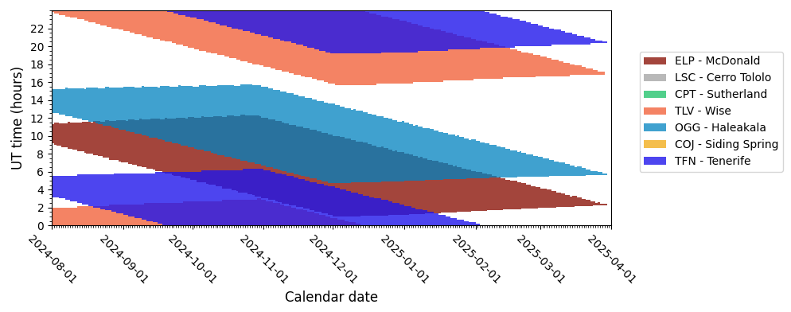
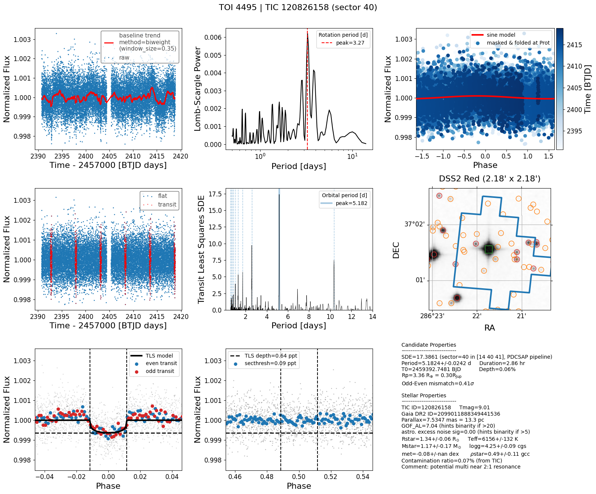
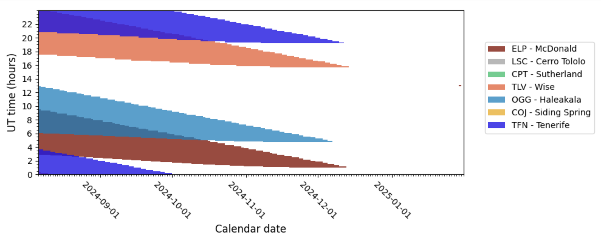

# search for young TTV systems
* [Summary](https://docs.google.com/presentation/d/1RcZO7T3xsw1v8DW2j34vQghfRDOaISgSo2AHm0FkW34/edit#slide=id.p)
* Search for TTVs in Kepler systems [Gajdos+2019](https://ui.adsabs.harvard.edu/abs/2019RAA....19...41G/abstract) 
* TTV systems in MMR [McDonald+2023](https://ui.adsabs.harvard.edu/abs/2023AJ....166...94M/abstract)

TODO:
- [x] find TOI/CTOIs/NExSci near period commensurability (see below)
- [x] rank them by min distance from commensurability (=delta) 
- [x] check for possible TTVs in known systems with low delta
  - [x] indicate known TTVs from literature (potential improvements if recently observed by TESS)
  - [x] check if observed by TESS using [tess-point](https://github.com/tessgi/tess-point)
  - [ ] estimate TTV amplitude using [TTVfaster](https://github.com/ericagol/TTVFaster)
- [x] find single systems with reported TTVs
- [ ] look for signs of youth  
  - [ ] measure Prot in TESS lc
  - [ ] cross-match with catalogs e.g. LiEW
- [ ] measure TTVs using [allesfitter](https://github.com/MNGuenther/allesfitter)
- [x] filter candidates with depth > 1ppt (see full list in [data](https://github.com/jpdeleon/young_ttvs/tree/main/data))

Note:
* `tess_orbit_times.csv` downloaded from https://tess.mit.edu/observations/ should be periodically updated in `allesfitter/_static/_tess/`

---

## TOIs near period commensurability

* Science: Discovery of new TTV (young) systems
* See [notebook](https://github.com/jpdeleon/young_ttvs/tree/main/notebooks/tois.ipynb)
* See full list @ [./data/tics_resonance_from_toi.csv](https://github.com/jpdeleon/young_ttvs/blob/main/data/tics_resonance_from_toi.csv)
 
TOI-2267 | [TIC-459837008](https://exofop.ipac.caltech.edu/tess/target.php?id=459837008) (nplanets=3):<br>
First Order: 9:8 | P=(2.03,2.29) (delta=0.02%)<br>
TESS sectors=[19 20 25 26 40 52 53 59 60 73 79]<br>

TOI-6109 | [TIC-384984325](https://exofop.ipac.caltech.edu/tess/target.php?id=384984325) (nplanets=2):<br>
First Order: 3:2 | P=(5.70,8.54) (delta=0.05%)<br>
TESS sectors=[18 58]<br>

TOI-6022 | [TIC-455947620](https://exofop.ipac.caltech.edu/tess/target.php?id=455947620) (nplanets=2):<br>
First Order: 5:4 | P=(1.55,1.93) (delta=0.19%)<br>
TESS sectors=[16 17 24 57 78]<br>

TOI-4323 | [TIC-143022742](https://exofop.ipac.caltech.edu/tess/target.php?id=143022742) (nplanets=2):<br>
First Order: 3:2 | P=(14.68,21.97) (delta=0.21%)<br>
TESS sectors=[ 4 31]<br>

TOI-6969 | [TIC-17129975](https://exofop.ipac.caltech.edu/tess/target.php?id=17129975) (nplanets=2):<br>
Second Order: 3:1 | P=(1.51,4.56) (delta=0.31%)
TESS sectors=[14 15 41 55 75]<br>

TOI-0406 | [TIC-153065527](https://exofop.ipac.caltech.edu/tess/target.php?id=153065527) (nplanets=2):<br>
First Order: 2:1 | P=(6.61,13.18) (delta=0.41%)<br>
TESS sectors=[ 3  4 30 31]<br>

TOI-5812 | [TIC-388909695](https://exofop.ipac.caltech.edu/tess/target.php?id=388909695) (nplanets=2):<br>
First Order: 4:3 | P=(10.15,13.47) (delta=0.44%)<br>
TESS sectors=[55 82]<br>

TOI-5520 | [TIC-374180079](https://exofop.ipac.caltech.edu/tess/target.php?id=374180079) (nplanets=2):<br>
First Order: 4:3 | P=(14.70,19.48) (delta=0.58%)<br>
TESS sectors=[35 45 46 62 72]<br>

TOI-0663 | [TIC-54962195](https://exofop.ipac.caltech.edu/tess/target.php?id=54962195) (nplanets=3):<br>
First Order: 3:2 | P=(4.70,7.10) (delta=0.76%)<br>
TESS sectors=[ 9 35 62]<br>

TOI-0216 | [TIC-55652896](https://exofop.ipac.caltech.edu/tess/target.php?id=55652896) (nplanets=2):<br>
First Order: 2:1 | P=(17.39,34.51) (delta=0.78%)<br>
TESS sectors=[ 1  2  3  4  5  6  7  8  9 11 12 13 27 28 29 30 31 32 33 34 35 36 37 38 39 61 62 63 64 65 66 67 68 69]<br>

---

## TOI with hint of TTVs

### TOI-6109

* Neptunes around a (young?) Sun-like star
* Lots of SG1 follow-up but inconclusive detections as of March 2024; observable with LCO in 2nd sem (see below)
* A. Datillo from THYME is working on this system according to [Spacebook TESS](https://spacebook.mit.edu/display/TESS/Publications)
* First Order: 3:2 | P=(5.70,8.54) (delta=0.05%)
* TESS sectors=[18 58]
* Both planets have depth>1ppt! ([exofop](https://exofop.ipac.caltech.edu/tess/target.php?id=TOI-6109))
* [results folder](https://github.com/jpdeleon/young_ttvs/tree/main/allesfitter/toi_in_resonance/toi6109/)




### TOI-4495

* [gdoc](https://docs.google.com/document/d/19l5jU4fl27R49VLlFScOgNs6GYOzoG3Ir6pZNWvpnWQ/edit#heading=h.qyhwhgwsjqv3)
* B. Hord's best in class paper validated the planet
* First Order: 2:1 | P=(2.57,5.18) (delta=0.86%)
* TESS sectors=[14 40 41 53 54 80 81]
* Note: the transit depths (<1 ppt) are too shallow for follow-up ([exofop](https://exofop.ipac.caltech.edu/tess/target.php?id=TOI-4495))
* [results folder](https://github.com/jpdeleon/young_ttvs/tree/main/allesfitter/toi_in_resonance/toi4495/)
 





### TOI-5493

* Second Order: 5:3 | P=(14.56,24.44) (delta=0.67%)
* TESS sectors=[ 7 34 44 45 46 61 72]
* Note: Only planet b has depth>1ppt ([exofop](https://exofop.ipac.caltech.edu/tess/target.php?id=TOI-5493))
* [results folder](https://github.com/jpdeleon/young_ttvs/tree/main/allesfitter/toi_in_resonance/toi5493/)
  


### TOI-6265

* S-type planet in a binary; Paper in prep by J. Zhang according to [Spacebook TESS](https://spacebook.mit.edu/display/TESS/Publications)
* Second Order: 7:5 | P=(4.18,5.79) (delta=0.98%)
* TESS sectors=[ 8 35 45 46 62 72]
* Both planets have depth<1ppt! ([exofop](https://exofop.ipac.caltech.edu/tess/target.php?id=TOI-6265))
* [results folder](https://github.com/jpdeleon/young_ttvs/tree/main/allesfitter/toi_in_resonance/toi6265/)


### TOI-1670

* Paper in prep by I. Mireles according to [Spacebook TESS](https://spacebook.mit.edu/display/TESS/Publications)
* Second Order: 3:1 | P=(40.75,123.06) (delta=0.66%)
* TESS sectors=[14 15 16 18 19 20 21 22 23 24 25 26 40 41 47 48 49 50 51 52 53 55 56 57
 58 59 60 73 74 75 76 77 78 79 80 81 82 83]
* Note: Only planet b has depth>1ppt ([exofop](https://exofop.ipac.caltech.edu/tess/target.php?id=TOI-1670))
* [results folder](https://github.com/jpdeleon/young_ttvs/tree/main/allesfitter/toi_in_resonance/toi1670)


---

## TOIs with sign of youth

### TOI-4323

* large contamination


## CTOI

* See [notebook](https://github.com/jpdeleon/young_ttvs/tree/main/notebooks/ctois.ipynb)

TIC 204497617 (nplanets=2): <br>
First Order: 2:1 | P=(3.18,1.59) n=(1,2) (delta=0.02%)
Second Order: 4:2 | P=(3.18,1.59) n=(1,2) (delta=0.02%)

TIC 347332255 (nplanets=2): <br>
First Order: 3:2 | P=(13.67,9.11) n=(1,2) (delta=0.02%)
Second Order: 6:4 | P=(13.67,9.11) n=(1,2) (delta=0.02%)

TIC 253922296 (nplanets=2): <br>
Second Order: 3:1 | P=(9.43,3.14) n=(1,2) (delta=0.03%)

TIC 29478974 (nplanets=2): <br>
First Order: 2:1 | P=(24.90,12.46) n=(1,2) (delta=0.06%)
Second Order: 4:2 | P=(24.90,12.46) n=(1,2) (delta=0.06%)

TIC 207080350 (nplanets=2): <br>
First Order: 2:1 | P=(18.38,9.11) n=(1,2) (delta=0.94%)
Second Order: 4:2 | P=(18.38,9.11) n=(1,2) (delta=0.94%)

### TIC 347332255


---

## Known systems from NExSci near period commensurability

### TOI 2076 b,c,d
* age < 500 Myr
* [Hedges+2021](https://ui.adsabs.harvard.edu/abs/2021AJ....162...54H/abstract) noted that planets are close to 5:3 orbital resonance, but further data are needed for a firm detection and to constrain the period of TOI-2076c
* [Osborn+2022](https://ui.adsabs.harvard.edu/abs/2022A%26A...664A.156O/abstract): clear anti-correlated TTV signal between planets b and c likely caused by their proximity to the 2:1 resonance, while planets c and d appear close to a 5:3 period
* Only few transits observed by TESS; Needs follow-up with LCO this sem but I guess Osborn is already working on this
* TESS sectors=[16 23 50 77]; sector 50 is still unpublished
* Planets b,c transit depths > 1ppt and planet d depth ~ 1ppt ([exofop](https://exofop.ipac.caltech.edu/tess/target.php?id=TOI-2076))


 
### TOI-1097 b,c

* [Wood+2023](https://ui.adsabs.harvard.edu/abs/2023AJ....165...85W/abstract): HD 109833 b,c in LCC (age=24±3 Myr)
* No mention of resonance or TTV in paper (purposely?)
* First Order: 3:2 | P=(9.19,13.90) (delta=0.87%)
* TESS sectors=[11 12 38 39 65]
* Both planets have depth<1ppt ([exofop](https://exofop.ipac.caltech.edu/tess/target.php?id=TOI-1097))
* [results folder](https://github.com/jpdeleon/young_ttvs/tree/main/allesfitter/toi_in_resonance/toi1097)
 


### K2-384

* 5 planets around an M-dwarf 
* [Christiansen+2022](https://exoplanetarchive.ipac.caltech.edu/overview/K2-384) noted resonance but did not do detailed TTV modeling because the predicted TTV amplitude (see below) is below the 30-min cadence of the K2 data
* Assuming circular orbits, the TTVFaster package (Agol & Deck 2016) predicts transit timing variations with amplitudes of 0.28, 0.83, 3.33, 12.26, and 3.97 minutes for planets b-f respectively
* S3, S30, S42, S43 according to the paper, and S70 according to tess-point

### K2-219 bcd

* [Mayo+2018](https://ui.adsabs.harvard.edu/abs/2018AJ....155..136M/abstract) did not mention any TTVs
* S42, S43, S70

---

* See full list @ [./data/name_resonance_from_nexsci.csv](https://github.com/jpdeleon/young_ttvs/blob/main/data/name_resonance_from_nexsci.csv)

TRAPPIST-1 (nplanets=7, [Agol+2021](https://exoplanetarchive.ipac.caltech.edu/overview/TRAPPIST-1), known TTV):<br>
First Order: 3:2 | P=(4.05,6.10) (delta=0.45%) 3:2 | P=(6.10,9.21) (delta=0.61%) 4:3 | P=(9.21,12.35) (delta=0.62%)<br>
Second Order: 5:3 | P=(2.42,4.05) (delta=0.31%) 6:4 | P=(4.05,6.10) (delta=0.45%) 6:4 | P=(6.10,9.21) (delta=0.61%) 8:6 | P=(9.21,12.35) (delta=0.62%)<br>
TESS sectors=[70]<br>

Kepler-11 (nplanets=6, [Lissauer+2013](https://exoplanetarchive.ipac.caltech.edu/overview/Kepler-11), known TTV):<br>
Second Order: 7:5 | P=(22.68,32.00) (delta=0.76%)<br>
TESS sectors=[14 15 41 54 55 74 75 81 82]<br>

HD 108236 (nplanets=5, [Bonfanti+2021](https://exoplanetarchive.ipac.caltech.edu/overview/HD 108236), known TTV):<br>
First Order: 3:2 | P=(19.59,29.54) (delta=0.53%)<br>
TESS sectors=[10 11 37]<br>

K2-285 (nplanets=4, [Palle+2019](https://exoplanetarchive.ipac.caltech.edu/overview/K2-285)):<br>
Second Order: 7:5 | P=(10.46,14.76) (delta=0.85%)<br>
TESS sectors=[42 70]<br>

K2-266 (nplanets=4, [Rodriguez+2018](https://exoplanetarchive.ipac.caltech.edu/overview/K2-266), known TTV):<br>
First Order: 4:3 | P=(14.70,19.48) (delta=0.58%)<br>
TESS sectors=[35 45 46 62 72]<br>

Kepler-297 (nplanets=3, [Q1_Q17_Dr25_Koi_Table](https://exoplanetarchive.ipac.caltech.edu/overview/Kepler-297), known TTV):<br>
First Order: 2:1 | P=(74.92,150.02) (delta=0.12%)<br>
TESS sectors=[14 15 40 41 53 54 55 74 75 80 81 82]<br>

TOI-216 (nplanets=2, [Dawson+2021](https://exoplanetarchive.ipac.caltech.edu/overview/TOI-216), known TTV):<br>
First Order: 2:1 | P=(17.16,34.53) (delta=0.59%)<br>
TESS sectors=[ 1  2  3  4  5  6  7  8  9 11 12 13 27 28 29 30 31 32 33 34 35 36 37 38 39 61 62 63 64 65 66 67 68 69]<br>

Kepler-177 (nplanets=2, [Vissapragada+2020](https://exoplanetarchive.ipac.caltech.edu/overview/Kepler-177), known TTV):<br>
First Order: 4:3 | P=(36.86,49.41) (delta=0.53%)<br>
TESS sectors=[14 26 40 41 53 55 74 75 80 81 82]<br>

Kepler-29 (nplanets=2, [Vissapragada+2020](https://exoplanetarchive.ipac.caltech.edu/overview/Kepler-29), known TTV):<br>
Second Order: 9:7 | P=(10.34,13.29) (delta=0.06%)<br>
TESS sectors=[14 15 41 54 56 74 75 76 81 82]<br>

KIC 5437945 (nplanets=2, [Wang+2015](https://exoplanetarchive.ipac.caltech.edu/overview/KIC 5437945)):<br>
First Order: 2:1 | P=(220.13,440.78) (delta=0.12%)<br>
TESS sectors=[14 40 41 54 55 74 75 80 81]<br>

## Single systems with reported TTVs

* Science: Discovery of new transiting planets; ephemeris recovery
* See full list @ [./data/nexsci_ttv_single.csv](https://github.com/jpdeleon/young_ttvs/blob/main/data/nexsci_ttv_single.csv)

WASP-43 (nplanets=1, [Hellier+2011](https://exoplanetarchive.ipac.caltech.edu/overview/WASP-43), known TTV):<br>
TESS sectors=[ 9 35 62]<br>

KOI-984 (nplanets=1, [Sun+2022](https://exoplanetarchive.ipac.caltech.edu/overview/KOI-984), known TTV):<br>
TESS sectors=[14 40 41 54 74 75 81]<br>

Qatar-1 (nplanets=1, [Collins+2017](https://exoplanetarchive.ipac.caltech.edu/overview/Qatar-1), known TTV):<br>
TESS sectors=[15 16 17 18 21 24 25 41 48 51 55 56 57 58 59 75 76 77 78 82 83]<br>

WASP-18 (nplanets=1, [Cort_Eacute_S_Zuleta+2020](https://exoplanetarchive.ipac.caltech.edu/overview/WASP-18), known TTV):<br>
TESS sectors=[ 2  3 29 30 69]<br>

KELT-19 A (nplanets=1, [Siverd+2018](https://exoplanetarchive.ipac.caltech.edu/overview/KELT-19 A), known TTV):<br>
TESS sectors=[ 7 33]<br>

KOI-217 (nplanets=1, [Howell+2010](https://exoplanetarchive.ipac.caltech.edu/overview/KOI-217), known TTV):<br>
TESS sectors=[14 15 40 41 54 74 75 81 82]<br>

CoRoT-2 (nplanets=1, [Gillon+2010](https://exoplanetarchive.ipac.caltech.edu/overview/CoRoT-2), known TTV):<br>
TESS sectors=[54 81]<br>

TrES-3 (nplanets=1, [Sozzetti+2009](https://exoplanetarchive.ipac.caltech.edu/overview/TrES-3), known TTV):<br>
TESS sectors=[25 26 26 40 52 53 79 80]<br>

CoRoT-35 (nplanets=1, [Sebastian+2022](https://exoplanetarchive.ipac.caltech.edu/overview/CoRoT-35), known TTV):<br>
TESS sectors=[54]<br>

## Multis with reported TTVs

* Science: Improvement of TTV model using new TESS data
* See full list @ [./data/nexsci_ttv_multis.csv](https://github.com/jpdeleon/young_ttvs/blob/main/data/nexsci_ttv_multis.csv)
* See [notebook](https://github.com/jpdeleon/young_ttvs/tree/main/notebooks/nexsci.ipynb)
* Note: All targets indicated with `known TTV` from NExSci
* Note: Kepler targets have very shallow depths so better focus on K2, TOI, or other targets
* See also [Jontof-Hutter+2022](https://ui.adsabs.harvard.edu/abs/2022AJ....164...42J/abstract)
  
Kepler-30 (nplanets=1, [Sanchis_Ojeda+2012](https://exoplanetarchive.ipac.caltech.edu/overview/Kepler-30), known TTV):<br>
TESS sectors=[14 26 40 41 53 54 74 80 81]<br>

Kepler-18 (nplanets=1, [Cochran+2011](https://exoplanetarchive.ipac.caltech.edu/overview/Kepler-18), known TTV):<br>
TESS sectors=[14 15 41 54 55 74 75 81 82]<br>

Kepler-111 (nplanets=1, [Dalba+2024](https://exoplanetarchive.ipac.caltech.edu/overview/Kepler-111), known TTV):<br>
TESS sectors=[15 40 41 54 74 75 81 82]<br>

Kepler-29 (nplanets=1, [Vissapragada+2020](https://exoplanetarchive.ipac.caltech.edu/overview/Kepler-29), known TTV):<br>
TESS sectors=[14 15 41 54 56 74 75 76 81 82]<br>

KOI-1783 (nplanets=1, [Vissapragada+2020](https://exoplanetarchive.ipac.caltech.edu/overview/KOI-1783), known TTV):<br>
TESS sectors=[14 15 40 41 53 54 55 74 75 80 81 82]<br>

Kepler-31 (nplanets=1, [Fabrycky+2012](https://exoplanetarchive.ipac.caltech.edu/overview/Kepler-31), known TTV):<br>
TESS sectors=[14 15 40 74 75 81 82]<br>

Kepler-30 (nplanets=1, [Sanchis_Ojeda+2012](https://exoplanetarchive.ipac.caltech.edu/overview/Kepler-30), known TTV):<br>
TESS sectors=[14 26 40 41 53 54 74 80 81]<br>

Kepler-79 (nplanets=1, [Jontof_Hutter+2014](https://exoplanetarchive.ipac.caltech.edu/overview/Kepler-79), known TTV):<br>
TESS sectors=[14 15 41 54 55 74 75 81 82]<br>

Kepler-31 (nplanets=1, [Fabrycky+2012](https://exoplanetarchive.ipac.caltech.edu/overview/Kepler-31), known TTV):<br>
TESS sectors=[14 15 40 74 75 81 82]<br>

Kepler-32 (nplanets=1, [Fabrycky+2012](https://exoplanetarchive.ipac.caltech.edu/overview/Kepler-32), known TTV):<br>
TESS sectors=[14 15 41 54 55 74 75 81 82]<br>

Kepler-177 (nplanets=1, [Vissapragada+2020](https://exoplanetarchive.ipac.caltech.edu/overview/Kepler-177), known TTV):<br>
TESS sectors=[14 26 40 41 53 55 74 75 80 81 82]<br>

TOI-216 (nplanets=1, [Dawson+2021](https://exoplanetarchive.ipac.caltech.edu/overview/TOI-216), known TTV):<br>
TESS sectors=[ 1  2  3  4  5  6  7  8  9 11 12 13 27 28 29 30 31 32 33 34 35 36 37 38
 39 61 62 63 64 65 66 67 68 69]<br>

TOI-216 (nplanets=1, [Dawson+2021](https://exoplanetarchive.ipac.caltech.edu/overview/TOI-216), known TTV):<br>
TESS sectors=[ 1  2  3  4  5  6  7  8  9 11 12 13 27 28 29 30 31 32 33 34 35 36 37 38
 39 61 62 63 64 65 66 67 68 69]<br>

AU Mic (nplanets=1, [Wittrock+2023](https://exoplanetarchive.ipac.caltech.edu/overview/AU Mic), known TTV):<br>
TESS sectors=[ 1 27]<br>

Kepler-11 (nplanets=1, [Lissauer+2013](https://exoplanetarchive.ipac.caltech.edu/overview/Kepler-11), known TTV):<br>
TESS sectors=[14 15 41 54 55 74 75 81 82]<br>

TRAPPIST-1 (nplanets=1, [Agol+2021](https://exoplanetarchive.ipac.caltech.edu/overview/TRAPPIST-1), known TTV):<br>
TESS sectors=[70]<br>

TRAPPIST-1 (nplanets=1, [Agol+2021](https://exoplanetarchive.ipac.caltech.edu/overview/TRAPPIST-1), known TTV):<br>
TESS sectors=[70]<br>

Kepler-32 (nplanets=1, [Fabrycky+2012](https://exoplanetarchive.ipac.caltech.edu/overview/Kepler-32), known TTV):<br>
TESS sectors=[14 15 41 54 55 74 75 81 82]<br>

Kepler-11 (nplanets=1, [Lissauer+2013](https://exoplanetarchive.ipac.caltech.edu/overview/Kepler-11), known TTV):<br>
TESS sectors=[14 15 41 54 55 74 75 81 82]<br>

Kepler-18 (nplanets=1, [Cochran+2011](https://exoplanetarchive.ipac.caltech.edu/overview/Kepler-18), known TTV):<br>
TESS sectors=[14 15 41 54 55 74 75 81 82]<br>

Kepler-30 (nplanets=1, [Sanchis_Ojeda+2012](https://exoplanetarchive.ipac.caltech.edu/overview/Kepler-30), known TTV):<br>
TESS sectors=[14 26 40 41 53 54 74 80 81]<br>

TOI-1266 (nplanets=1, [Cloutier+2024](https://exoplanetarchive.ipac.caltech.edu/overview/TOI-1266), known TTV):<br>
TESS sectors=[14 15 21 22 41 48 49 75 76]<br>

TOI-1266 (nplanets=1, [Cloutier+2024](https://exoplanetarchive.ipac.caltech.edu/overview/TOI-1266), known TTV):<br>
TESS sectors=[14 15 21 22 41 48 49 75 76]<br>

TRAPPIST-1 (nplanets=1, [Agol+2021](https://exoplanetarchive.ipac.caltech.edu/overview/TRAPPIST-1), known TTV):<br>
TESS sectors=[70]<br>

TRAPPIST-1 (nplanets=1, [Agol+2021](https://exoplanetarchive.ipac.caltech.edu/overview/TRAPPIST-1), known TTV):<br>
TESS sectors=[70]<br>

K2-266 (nplanets=1, [Rodriguez+2018](https://exoplanetarchive.ipac.caltech.edu/overview/K2-266), known TTV):<br>
TESS sectors=[35 45 46 62 72]<br>

TRAPPIST-1 (nplanets=1, [Agol+2021](https://exoplanetarchive.ipac.caltech.edu/overview/TRAPPIST-1), known TTV):<br>
TESS sectors=[70]<br>

TRAPPIST-1 (nplanets=1, [Agol+2021](https://exoplanetarchive.ipac.caltech.edu/overview/TRAPPIST-1), known TTV):<br>
TESS sectors=[70]<br>

TRAPPIST-1 (nplanets=1, [Agol+2021](https://exoplanetarchive.ipac.caltech.edu/overview/TRAPPIST-1), known TTV):<br>
TESS sectors=[70]<br>

K2-266 (nplanets=1, [Rodriguez+2018](https://exoplanetarchive.ipac.caltech.edu/overview/K2-266), known TTV):<br>
TESS sectors=[35 45 46 62 72]<br>


### with Prot
['HD 23472']: Prot=[40.1] d <br>
      pl_name  pl_orbper <br>
0  HD 23472 d   3.976640<br>
1  HD 23472 e   7.907540<br>
2  HD 23472 f  12.162184<br>
3  HD 23472 c  29.797490<br>
4  HD 23472 b  17.667087<br>
['Kepler-102']: Prot=[27.95] d <br>
        pl_name  pl_orbper <br>
0  Kepler-102 b   5.286965<br>
1  Kepler-102 c   7.071392<br>
2  Kepler-102 d  10.311767<br>
3  Kepler-102 e  16.145699<br>
4  Kepler-102 f  27.453592<br>
['V1298 Tau']: Prot=[2.87] d<br>
       pl_name  pl_orbper<br>
0  V1298 Tau b   24.13960<br>
1  V1298 Tau d   12.40320<br>
2  V1298 Tau e   60.00000<br>
3  V1298 Tau c    8.24958<br>
['L 98-59']: Prot=[78.  80.9] d<br>
     pl_name  pl_orbper<br>
0  L 98-59 d   7.450729<br>
1  L 98-59 b   2.253114<br>
2  L 98-59 c   3.690675<br>
['HD 109833']: Prot=[5.11] d<br>
       pl_name  pl_orbper<br>
0  HD 109833 b   9.188526<br>
1  HD 109833 c  13.900148<br>
  
## TTV Candidates from Kruse+2018
* EPIC 201561956
* EPIC 212639319
* EPIC 220639177

## Known young TTVs
* V1298 Tau bcde
* Au Mic bcd
  - [Wittrock+2023b](https://ui.adsabs.harvard.edu/abs/2023arXiv230204922W/abstract)
  - d is non-transiting and interior or b & c orbits 
* TOI-1136
  - [Dai+2023](https://ui.adsabs.harvard.edu/abs/2023AJ....165...33D/abstract)
  -  700 ± 150 Myr old G star hosting 
  -  at least 6 transiting planets: 2-5 Re
  -  TTV masses: 3-8Me 
  -  period ratios near 3:2, 2:1, 3:2, 7:5, and 3:2 <-- first known resonant chain involving a second-order MMR (7:5)
  - RM observation confirmed that planet d's orbit is aligned with stellar rotation

## Tools
- [transit-timing](https://github.com/transit-timing/tt), see ttv [database](https://github.com/transit-timing/tt/blob/master/3_database/table4.csv)

## Environment
```shell
$ conda env create -f environment.yml
```

