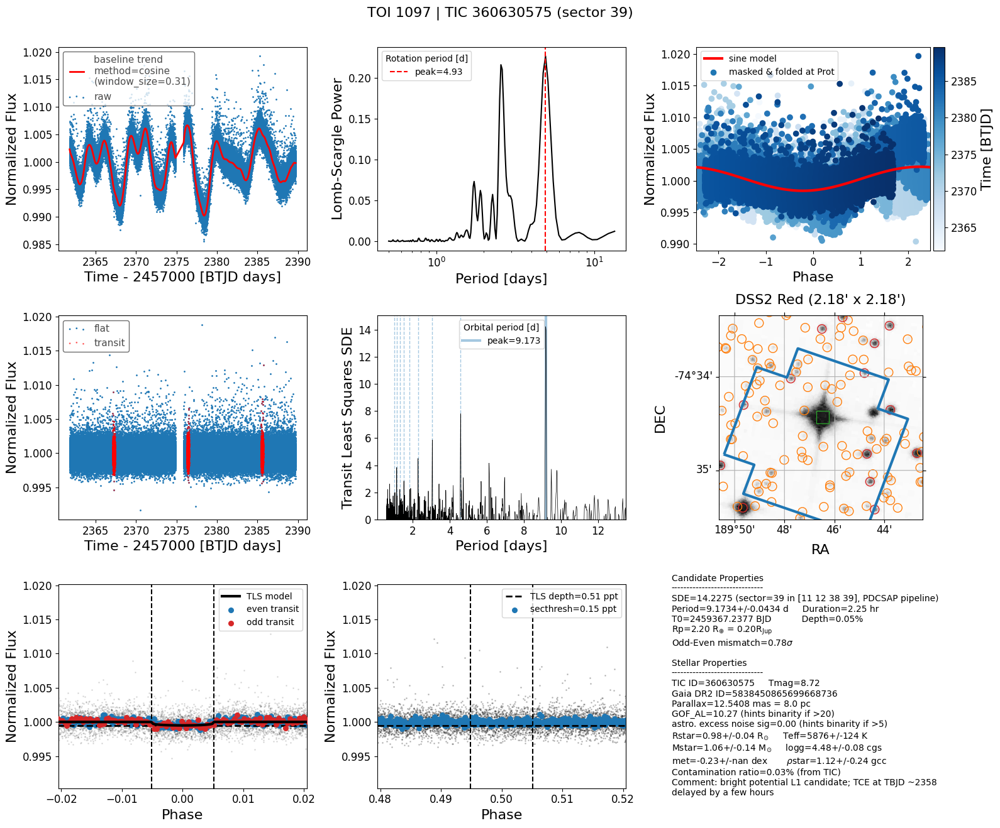
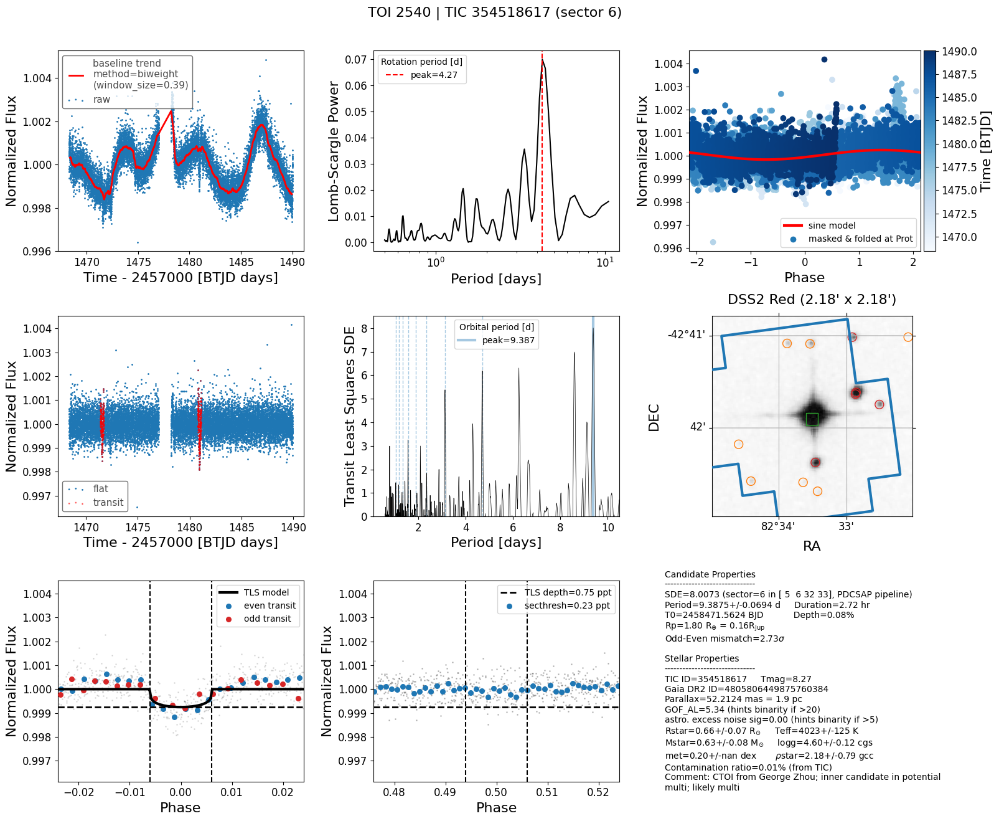
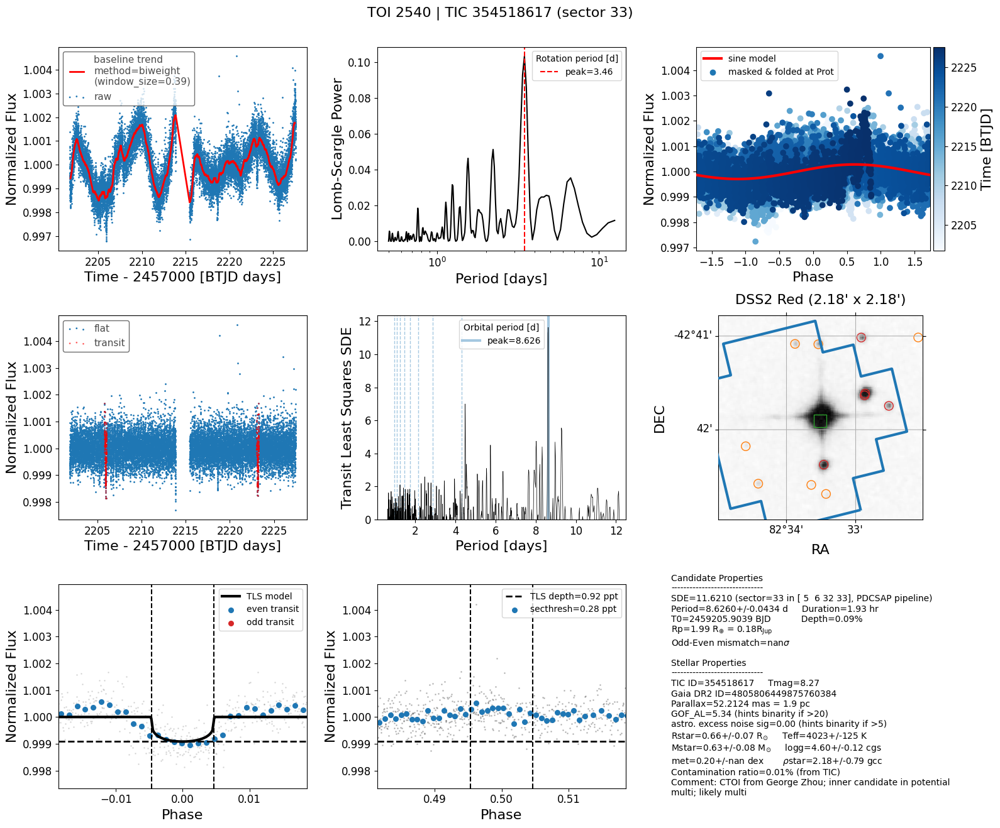

# search for young TTV systems
- [x] find TOI/CTOIs near MMR (see below)
- [x] look for signs of youth e.g. strong Prot signal in TESS
- [x] make a short list 
- [ ] measure TTVs
 
## TOIs with period commensurability
TOI 2104 | TIC 367630162 (nplanets=5):<br>
9:5 | P=(3.27,5.90) n=(2,1) (delta=0.24%)

TOI 174 | TIC 425997655 (nplanets=5):<br>
2:1 | P=(3.98,7.91) n=(5,4) (delta=0.58%)

TOI 282 | TIC 29781292 (nplanets=4):<br>
8:3 | P=(31.32,84.26) n=(3,2) (delta=0.87%)

3:2 | P=(56.01,84.26) n=(3,1) (delta=0.30%)

TOI 700 | TIC 150428135 (nplanets=4):<br>
7:3 | P=(16.05,37.42) n=(2,1) (delta=0.08%)

3:1 | P=(6.26,18.80) n=(4,2) (delta=0.15%)

2:1 | P=(6.23,12.57) n=(3,1) (delta=0.91%)

TOI 1339 | TIC 269701147 (nplanets=3):<br>
4:3 | P=(28.58,38.35) n=(3,2) (delta=0.64%)

TOI 2269 | TIC 441798995 (nplanets=3):<br>
2:1 | P=(1.42,2.84) n=(2,1) (delta=0.00%)

3:1 | P=(40.75,123.06) n=(3,1) (delta=0.66%)

TOI 699 | TIC 149302744 (nplanets=3):<br>
9:4 | P=(14.80,33.63) n=(2,1) (delta=0.99%)

TOI 270 | TIC 259377017 (nplanets=3):<br>
2:1 | P=(5.66,11.38) n=(2,1) (delta=0.51%)

9:4 | P=(6.39,14.33) n=(3,1) (delta=0.28%)

TOI 1208 | TIC 273985865 (nplanets=3):<br>
8:5 | P=(10.98,17.73) n=(3,2) (delta=0.87%)

TOI 696 | TIC 77156829 (nplanets=3):<br>
4:3 | P=(3.69,4.97) n=(3,2) (delta=0.80%)

TOI 663 | TIC 54962195 (nplanets=3):<br>
9:5 | P=(2.60,4.70) n=(2,1) (delta=0.37%), 3:2 | P=(4.70,7.10) n=(3,2) (delta=0.84%)

TOI 175 | TIC 307210830 (nplanets=3):<br>
2:1 | P=(3.69,7.45) n=(2,1) (delta=0.93%)

TOI 1692 | TIC 288636342 (nplanets=2):<br>
9:5 | P=(17.73,32.21) n=(2,1) (delta=0.92%)

TOI 1097 | TIC 360630575 (nplanets=2):<br>
3:2 | P=(9.19,13.90) n=(2,1) (delta=0.86%)

TOI 2540 | TIC 354518617 (nplanets=2):<br>
7:4 | P=(12.72,22.08) n=(2,1) (delta=0.80%)

TOI 714 | TIC 219195044 (nplanets=2):<br>
7:3 | P=(4.32,10.18) n=(2,1) (delta=0.87%)

TOI 5520 | TIC 374180079 (nplanets=2):<br>
4:3 | P=(14.70,19.48) n=(2,1) (delta=0.58%)

TOI 1749 | TIC 233602827 (nplanets=2):<br>
2:1 | P=(4.49,9.04) n=(2,1) (delta=0.73%)

TOI 6054 | TIC 392681545 (nplanets=2):<br>
5:3 | P=(7.49,12.58) n=(2,1) (delta=0.73%)

TOI 4323 | TIC 143022742 (nplanets=2):<br>
3:2 | P=(14.68,21.97) n=(2,1) (delta=0.21%)

TOI 2095 | TIC 235678745 (nplanets=2):<br>
8:5 | P=(17.66,28.17) n=(2,1) (delta=0.32%)

## TOIs with sign of youth
### TOI 1097 
* THYME IX: HD 109833 b,c in LCC (24±3 Myr)
* [Wood+2023](https://ui.adsabs.harvard.edu/abs/2023AJ....165...85W/abstract)
* No mention of resonance in paper; But actually in 3:2 (9.188525, 13.900142)


### TOI 2540
* in 7:4 | P=(12.72,22.08)
* TQL Porb is wrong (need multi-sector lcs)




## CTOI
TIC 150442264 (nplanets=2):
9:5 | P=(1.65,2.98) n=(2,1) (delta=0.23%)

TIC 224299081 (nplanets=2):
9:5 | P=(21.06,38.00) n=(2,1) (delta=0.24%)

TIC 204497617 (nplanets=2):<br>
2:1 | P=(1.59,3.18) n=(2,1) (delta=0.02%)

TIC 207080350 (nplanets=2):<br>
2:1 | P=(9.11,18.38) n=(2,1) (delta=0.93%)

TIC 347332255 (nplanets=2):<br>
3:2 | P=(9.11,13.67) n=(2,1) (delta=0.02%)

TIC 354518617 (nplanets=2):<br>
9:5 | P=(12.72,22.75) n=(2,1) (delta=0.63%)

TIC 253922296 (nplanets=2):<br>
3:1 | P=(3.14,9.43) n=(2,1) (delta=0.03%)

## Known young TTVs
* V1298 Tau bcde
* TOI 1136
  - [Dai+2023](https://ui.adsabs.harvard.edu/abs/2023AJ....165...33D/abstract)
  -  700 ± 150 Myr old G star hosting 
  -  at least 6 transiting planets: 2-5 Re
  -  TTV masses: 3-8Me 
  -  period ratios near 3:2, 2:1, 3:2, 7:5, and 3:2 <-- first known resonant chain involving a second-order MMR (7:5)
  - RM observation confirmed that planet d's orbit is aligned with stellar rotation

## Tools
- [transit-timing](https://github.com/transit-timing/tt), see ttv [database](https://github.com/transit-timing/tt/blob/master/3_database/table4.csv)

## Environment
```shell
$ conda env create -f environment.yml
```

