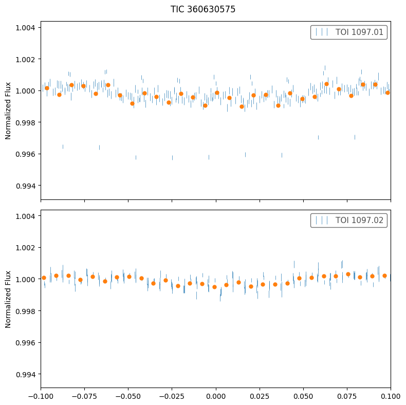
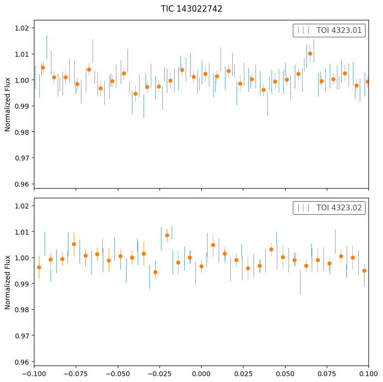

# search for young TTV systems
- [x] find TOI/CTOIs near MMR (see below)
- [x] look for signs of youth e.g. strong Prot signal in TESS
- [x] make a short list 
- [ ] measure TTVs
 
## TOIs near period commensurability
TOI 2104 | TIC 367630162 (nplanets=5):<br>
Second Order: 5:3 | P=(3.27,1.98) n=(1,2) (delta=0.85%)

TOI 174 | TIC 425997655 (nplanets=5):<br>
First Order: 2:1 | P=(7.91,3.98) n=(1,2) (delta=0.57%)<br>
Second Order: 4:2 | P=(7.91,3.98) n=(1,2) (delta=0.57%)

TOI 1136 | TIC 142276270 (nplanets=4):<br>
First Order: 2:1 | P=(12.52,6.26) n=(1,2) (delta=0.01%) 3:2 | P=(18.80,12.52) n=(2,3) (delta=0.14%)<br>
Second Order: 4:2 | P=(12.52,6.26) n=(1,2) (delta=0.01%) 6:4 | P=(18.80,12.52) n=(2,3) (delta=0.14%) 7:5 | P=(26.32,18.80) n=(3,4) (delta=0.03%)

TOI 700 | TIC 150428135 (nplanets=4):<br>
First Order: 4:3 | P=(37.42,27.81) n=(3,4) (delta=0.93%)<br>
Second Order: 8:6 | P=(37.42,27.81) n=(3,4) (delta=0.93%)

TOI 282 | TIC 29781292 (nplanets=4):<br>
First Order: 3:2 | P=(84.26,56.01) n=(3,4) (delta=0.30%)<br>
Second Order: 6:4 | P=(84.26,56.01) n=(3,4) (delta=0.30%)

TOI 1339 | TIC 269701147 (nplanets=3):<br>
First Order: 4:3 | P=(38.35,28.58) n=(2,3) (delta=0.64%)<br>
Second Order: 8:6 | P=(38.35,28.58) n=(2,3) (delta=0.64%)

TOI 175 | TIC 307210830 (nplanets=3):<br>
First Order: 2:1 | P=(7.45,3.69) n=(2,3) (delta=0.94%)<br>
Second Order: 4:2 | P=(7.45,3.69) n=(2,3) (delta=0.94%)

TOI 663 | TIC 54962195 (nplanets=3):<br>
First Order: 3:2 | P=(7.10,4.70) n=(2,3) (delta=0.84%)<br>
Second Order: 6:4 | P=(7.10,4.70) n=(2,3) (delta=0.84%)

TOI 1730 | TIC 318022259 (nplanets=3):<br>
First Order: 2:1 | P=(12.57,6.23) n=(2,3) (delta=0.91%)<br>
Second Order: 4:2 | P=(12.57,6.23) n=(2,3) (delta=0.91%)

TOI 270 | TIC 259377017 (nplanets=3):<br>
First Order: 2:1 | P=(11.38,5.66) n=(2,3) (delta=0.52%)<br>
Second Order: 4:2 | P=(11.38,5.66) n=(2,3) (delta=0.52%)

TOI 396 | TIC 178155732 (nplanets=3):<br>
Second Order: 5:3 | P=(5.97,3.59) n=(1,2) (delta=0.03%)

TOI 1670 | TIC 441739020 (nplanets=3):<br>
Second Order: 3:1 | P=(123.06,40.75) n=(2,3) (delta=0.66%)

TOI 2269 | TIC 441798995 (nplanets=3):<br>
First Order: 2:1 | P=(2.84,1.42) n=(1,2) (delta=0.00%)<br>
Second Order: 4:2 | P=(2.84,1.42) n=(1,2) (delta=0.00%)

TOI 696 | TIC 77156829 (nplanets=3):<br>
First Order: 4:3 | P=(4.97,3.69) n=(2,3) (delta=0.80%)<br>
Second Order: 8:6 | P=(4.97,3.69) n=(2,3) (delta=0.80%)

TOI 4495 | TIC 120826158 (nplanets=2):<br>
First Order: 2:1 | P=(5.18,2.57) n=(1,2) (delta=0.86%)<br>
Second Order: 4:2 | P=(5.18,2.57) n=(1,2) (delta=0.86%)

TOI 1749 | TIC 233602827 (nplanets=2):<br>
First Order: 2:1 | P=(9.04,4.49) n=(1,2) (delta=0.74%)<br>
Second Order: 4:2 | P=(9.04,4.49) n=(1,2) (delta=0.74%)

TOI 5520 | TIC 374180079 (nplanets=2):<br>
First Order: 4:3 | P=(19.48,14.70) n=(1,2) (delta=0.58%)<br>
Second Order: 8:6 | P=(19.48,14.70) n=(1,2) (delta=0.58%)

TOI 4323 | TIC 143022742 (nplanets=2):<br>
First Order: 3:2 | P=(21.97,14.68) n=(1,2) (delta=0.21%)<br>
Second Order: 6:4 | P=(21.97,14.68) n=(1,2) (delta=0.21%)

TOI 406 | TIC 153065527 (nplanets=2):<br>
First Order: 2:1 | P=(13.18,6.61) n=(1,2) (delta=0.41%)<br>
Second Order: 4:2 | P=(13.18,6.61) n=(1,2) (delta=0.41%)

TOI 6054 | TIC 392681545 (nplanets=2):<br>
Second Order: 5:3 | P=(12.58,7.49) n=(1,2) (delta=0.74%)

TOI 216 | TIC 55652896 (nplanets=2):<br>
First Order: 2:1 | P=(34.55,17.39) n=(1,2) (delta=0.64%)<br>
Second Order: 4:2 | P=(34.55,17.39) n=(1,2) (delta=0.64%)

TOI 1097 | TIC 360630575 (nplanets=2):<br>
First Order: 3:2 | P=(13.90,9.19) n=(1,2) (delta=0.87%)<br>
Second Order: 6:4 | P=(13.90,9.19) n=(1,2) (delta=0.87%)

## TOIs with sign of youth
### TOI 1097 
* THYME IX: HD 109833 b,c in LCC (24±3 Myr)
* [Wood+2023](https://ui.adsabs.harvard.edu/abs/2023AJ....165...85W/abstract)
* No mention of resonance in paper; But actually in 3:2 (9.188525, 13.900142)

* low SNR <br>


### TOI 4323
* large contamination

* de-trending (using wotan like in tql above) is needed to detect signal  <br>


## CTOI
TIC 204497617 (nplanets=2): <br>
First Order: 2:1 | P=(3.18,1.59) n=(1,2) (delta=0.02%)
Second Order: 4:2 | P=(3.18,1.59) n=(1,2) (delta=0.02%)

TIC 29478974 (nplanets=2): <br>
First Order: 2:1 | P=(24.90,12.46) n=(1,2) (delta=0.06%)
Second Order: 4:2 | P=(24.90,12.46) n=(1,2) (delta=0.06%)

TIC 207080350 (nplanets=2): <br>
First Order: 2:1 | P=(18.38,9.11) n=(1,2) (delta=0.94%)
Second Order: 4:2 | P=(18.38,9.11) n=(1,2) (delta=0.94%)

TIC 347332255 (nplanets=2): <br>
First Order: 3:2 | P=(13.67,9.11) n=(1,2) (delta=0.02%)
Second Order: 6:4 | P=(13.67,9.11) n=(1,2) (delta=0.02%)

TIC 253922296 (nplanets=2): <br>
Second Order: 3:1 | P=(9.43,3.14) n=(1,2) (delta=0.03%)

### TIC 347332255


## Known young TTVs
* V1298 Tau bcde
* TOI 1136
  - [Dai+2023](https://ui.adsabs.harvard.edu/abs/2023AJ....165...33D/abstract)
  -  700 ± 150 Myr old G star hosting 
  -  at least 6 transiting planets: 2-5 Re
  -  TTV masses: 3-8Me 
  -  period ratios near 3:2, 2:1, 3:2, 7:5, and 3:2 <-- first known resonant chain involving a second-order MMR (7:5)
  - RM observation confirmed that planet d's orbit is aligned with stellar rotation

## Tools
- [transit-timing](https://github.com/transit-timing/tt), see ttv [database](https://github.com/transit-timing/tt/blob/master/3_database/table4.csv)

## Environment
```shell
$ conda env create -f environment.yml
```

