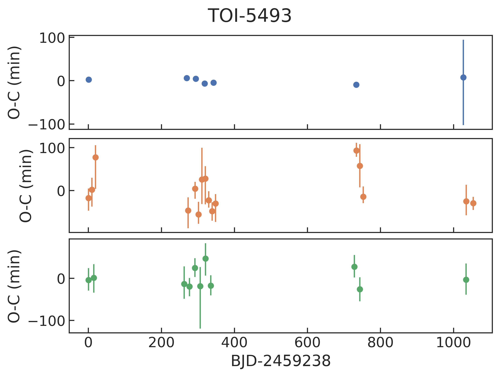

# search for young TTV systems
* [Summary](https://docs.google.com/presentation/d/1RcZO7T3xsw1v8DW2j34vQghfRDOaISgSo2AHm0FkW34/edit#slide=id.p)

TODO:
- [x] find TOI/CTOIs/NExSci near period commensurability (see below)
- [x] rank them by min distance from commensurability (=delta) 
- [x] check for possible TTVs in known systems with low delta
  - [x] indicate known TTVs from literature (potential improvements if recently observed by TESS)
  - [x] check if observed by TESS using [tess-point](https://github.com/tessgi/tess-point)
  - [ ] estimate TTV amplitude using [TTVfaster](https://github.com/ericagol/TTVFaster)
- [ ] look for signs of youth  
  - [ ] measure Prot in TESS lc
  - [ ] cross-match with catalogs e.g. LiEW
- [ ] measure TTVs using [allesfitter](https://github.com/MNGuenther/allesfitter)
- [ ] further filter candidates with depth > 1ppt (if ground-based follow-up is needed)
  
Note:
* `tess_orbit_times.csv` downloaded from https://tess.mit.edu/observations/ should be periodically updated in `allesfitter/_static/_tess/`

## TOIs near period commensurability
* See [notebook](https://github.com/jpdeleon/young_ttvs/tree/main/notebooks/tois.ipynb)
 
TOI-2269 | [TIC-441798995](https://exofop.ipac.caltech.edu/tess/target.php?id=441798995) (nplanets=3):<br>
First Order: 2:1 | P=(1.42,2.84) (delta=0.00%)<br>
TESS sectors=[14 15 16 17 18 19 20 21 22 23 24 25 26 40 41 47 48 49 50 51 52 53 54 55 56 57 58 59 60 73 74 75 76 77 78 79 80 81 82 83 84 85 86]<br>

TOI-1136 | [TIC-142276270](https://exofop.ipac.caltech.edu/tess/target.php?id=142276270) (nplanets=4):<br>
First Order: 2:1 | P=(6.26,12.52) (delta=0.01%) 3:2 | P=(12.52,18.80) (delta=0.14%)<br>
TESS sectors=[14 15 21 22 41 48 75]<br>

TOI-2267 | [TIC-459837008](https://exofop.ipac.caltech.edu/tess/target.php?id=459837008) (nplanets=3):<br>
First Order: 9:8 | P=(2.03,2.29) (delta=0.02%)<br>
TESS sectors=[19 20 25 26 40 52 53 59 60 73 79 86]<br>

TOI-0396 | [TIC-178155732](https://exofop.ipac.caltech.edu/tess/target.php?id=178155732) (nplanets=3):<br>
Second Order: 5:3 | P=(3.59,5.97) (delta=0.03%)
TESS sectors=[ 3  4 30 31]<br>

TOI-6109 | [TIC-384984325](https://exofop.ipac.caltech.edu/tess/target.php?id=384984325) (nplanets=2):<br>
First Order: 3:2 | P=(5.70,8.54) (delta=0.05%)<br>
TESS sectors=[18 58 85]<br>

TOI-1446 | [TIC-294471966](https://exofop.ipac.caltech.edu/tess/target.php?id=294471966) (nplanets=2):<br>
Second Order: 7:5 | P=(4.51,6.32) (delta=0.14%)
TESS sectors=[14 15 16 41 54 55 56 75 76 81 82 83]<br>

TOI-6022 | [TIC-455947620](https://exofop.ipac.caltech.edu/tess/target.php?id=455947620) (nplanets=2):<br>
First Order: 5:4 | P=(1.55,1.93) (delta=0.19%)<br>
TESS sectors=[16 17 24 57 78 84 85]<br>

TOI-4323 | [TIC-143022742](https://exofop.ipac.caltech.edu/tess/target.php?id=143022742) (nplanets=2):<br>
First Order: 3:2 | P=(14.68,21.97) (delta=0.21%)<br>
TESS sectors=[ 4 31]<br>

TOI-4647 | [TIC-303204165](https://exofop.ipac.caltech.edu/tess/target.php?id=303204165) (nplanets=2):<br>
First Order: 5:4 | P=(8.83,11.07) (delta=0.24%)<br>
TESS sectors=[42 43 57 70 84]<br>

TOI-2076 | [TIC-27491137](https://exofop.ipac.caltech.edu/tess/target.php?id=27491137) (nplanets=3):<br>
Second Order: 5:3 | P=(21.02,35.13) (delta=0.29%)
TESS sectors=[16 23 50 77]<br>

TOI-0282 | [TIC-29781292](https://exofop.ipac.caltech.edu/tess/target.php?id=29781292) (nplanets=4):<br>
First Order: 3:2 | P=(56.00,84.26) (delta=0.30%)<br>
TESS sectors=[ 1  2  3  4  5  6  7  8  9 10 11 12 13 27 28 29 30 31 33 34 35 36 37 38 39 61 62 63 64 65 66 67 68 69 87 88 89 90 93 94 95 96]<br>

TOI-6969 | [TIC-17129975](https://exofop.ipac.caltech.edu/tess/target.php?id=17129975) (nplanets=2):<br>
Second Order: 3:1 | P=(1.51,4.56) (delta=0.31%)
TESS sectors=[14 15 41 55 75]<br>

TOI-0406 | [TIC-153065527](https://exofop.ipac.caltech.edu/tess/target.php?id=153065527) (nplanets=2):<br>
First Order: 2:1 | P=(6.61,13.18) (delta=0.41%)<br>
TESS sectors=[ 3  4 30 31]<br>

TOI-0270 | [TIC-259377017](https://exofop.ipac.caltech.edu/tess/target.php?id=259377017) (nplanets=3):<br>
First Order: 2:1 | P=(5.66,11.38) (delta=0.52%)<br>
TESS sectors=[ 3  4  5 30 32]<br>

TOI-0174 | [TIC-425997655](https://exofop.ipac.caltech.edu/tess/target.php?id=425997655) (nplanets=5):<br>
First Order: 2:1 | P=(3.98,7.91) (delta=0.58%)<br>
TESS sectors=[ 1  2  3  4 11 29 30 31 34 64 68 69 95 96]<br>

TOI-5520 | [TIC-374180079](https://exofop.ipac.caltech.edu/tess/target.php?id=374180079) (nplanets=2):<br>
First Order: 4:3 | P=(14.70,19.48) (delta=0.58%)<br>
TESS sectors=[35 45 46 62 72 89]<br>

TOI-0216 | [TIC-55652896](https://exofop.ipac.caltech.edu/tess/target.php?id=55652896) (nplanets=2):<br>
First Order: 2:1 | P=(17.39,34.55) (delta=0.64%)<br>
TESS sectors=[ 1  2  3  4  5  6  7  8  9 11 12 13 27 28 29 30 31 32 33 34 35 36 37 38 39 61 62 63 64 65 66 67 68 69 87 88 89 90 93 94 95 96]<br>

TOI-1339 | [TIC-269701147](https://exofop.ipac.caltech.edu/tess/target.php?id=269701147) (nplanets=3):<br>
First Order: 4:3 | P=(28.58,38.35) (delta=0.64%)<br>
TESS sectors=[14 15 16 17 18 19 21 22 24 25 41 48 49 51 52 55 56 58 59 60 73 75 76 77 78 79 82 83 85 86]<br>

TOI-1670 | [TIC-441739020](https://exofop.ipac.caltech.edu/tess/target.php?id=441739020) (nplanets=3):<br>
Second Order: 3:1 | P=(40.75,123.06) (delta=0.66%)
TESS sectors=[14 15 16 18 19 20 21 22 23 24 25 26 40 41 47 48 49 50 51 52 53 55 56 57 58 59 60 73 74 75 76 77 78 79 80 81 82 83 84 85 86]<br>

TOI-5493 | [TIC-468979441](https://exofop.ipac.caltech.edu/tess/target.php?id=468979441) (nplanets=3):<br>
Second Order: 5:3 | P=(14.56,24.44) (delta=0.67%)
TESS sectors=[ 7 34 44 45 46 61 72 88]<br>

TOI-6276 | [TIC-397362481](https://exofop.ipac.caltech.edu/tess/target.php?id=397362481) (nplanets=3):<br>
Second Order: 7:5 | P=(4.47,6.21) (delta=0.70%)
TESS sectors=[63 64 90]<br>

TOI-0707 | [TIC-167342439](https://exofop.ipac.caltech.edu/tess/target.php?id=167342439) (nplanets=2):<br>
Second Order: 3:1 | P=(17.48,52.80) (delta=0.71%)
TESS sectors=[ 1  2  3  4  5  6  7  8  9 11 12 13 28 29 30 31 32 33 34 35 36 38 39 61 62 64 65 66 67 69 87 88 89 93 94 96]<br>

TOI-6054 | [TIC-392681545](https://exofop.ipac.caltech.edu/tess/target.php?id=392681545) (nplanets=2):<br>
Second Order: 5:3 | P=(7.49,12.58) (delta=0.74%)
TESS sectors=[19 59 86]<br>

TOI-1749 | [TIC-233602827](https://exofop.ipac.caltech.edu/tess/target.php?id=233602827) (nplanets=3):<br>
First Order: 2:1 | P=(4.49,9.04) (delta=0.74%)<br>
TESS sectors=[14 15 16 17 18 19 20 21 23 24 25 26 40 41 47 48 49 50 51 52 53 54 55 57 58 59 60 74 77 78 79 80 81 82 84 85 86]<br>

TOI-0663 | [TIC-54962195](https://exofop.ipac.caltech.edu/tess/target.php?id=54962195) (nplanets=3):<br>
First Order: 3:2 | P=(4.70,7.10) (delta=0.76%)<br>
TESS sectors=[ 9 35 62 89]<br>

TOI-0696 | [TIC-77156829](https://exofop.ipac.caltech.edu/tess/target.php?id=77156829) (nplanets=3):<br>
First Order: 4:3 | P=(3.69,4.97) (delta=0.80%)<br>
TESS sectors=[ 4  5 31 32]<br>

TOI-2104 | [TIC-367630162](https://exofop.ipac.caltech.edu/tess/target.php?id=367630162) (nplanets=5):<br>
Second Order: 5:3 | P=(1.98,3.27) (delta=0.85%)
TESS sectors=[14 19 20 26 40 47 53 73 74]<br>

TOI-4495 | [TIC-120826158](https://exofop.ipac.caltech.edu/tess/target.php?id=120826158) (nplanets=2):<br>
First Order: 2:1 | P=(2.57,5.18) (delta=0.86%)<br>
TESS sectors=[14 40 41 53 54 80 81]<br>

TOI-1097 | [TIC-360630575](https://exofop.ipac.caltech.edu/tess/target.php?id=360630575) (nplanets=2):<br>
First Order: 3:2 | P=(9.19,13.90) (delta=0.87%)<br>
TESS sectors=[11 12 38 39 65]<br>

TOI-0700 | [TIC-150428135](https://exofop.ipac.caltech.edu/tess/target.php?id=150428135) (nplanets=4):<br>
First Order: 4:3 | P=(27.81,37.42) (delta=0.93%)<br>
TESS sectors=[ 1  3  4  5  6  7  8  9 10 11 13 27 28 30 31 33 34 35 36 37 38 61 62 63 64 65 66 68 69 87 88 89 90 93 95 96]<br>

TOI-0175 | [TIC-307210830](https://exofop.ipac.caltech.edu/tess/target.php?id=307210830) (nplanets=3):<br>
First Order: 2:1 | P=(3.69,7.45) (delta=0.94%)<br>
TESS sectors=[ 2  5  8  9 10 11 12 28 29 32 35 36 37 38 39 61 62 63 64 65 69 87 88 89 90 96]<br>

TOI-1730 | [TIC-318022259](https://exofop.ipac.caltech.edu/tess/target.php?id=318022259) (nplanets=3):<br>
First Order: 2:1 | P=(6.23,12.57) (delta=0.98%)<br>
TESS sectors=[20 47 60]<br>

TOI-6265 | [TIC-344927749](https://exofop.ipac.caltech.edu/tess/target.php?id=344927749) (nplanets=2):<br>
Second Order: 7:5 | P=(4.18,5.79) (delta=0.98%)
TESS sectors=[ 8 35 45 46 62 72 89]<br>

## TOI with hint of TTVs

### TOI-6109

* Neptunes around a (young?) Sun-like star
* Lots of SG1 follow-up but inconclusive detections as of March 2024; observable with LCO in 2nd sem (see below)
* Can't check [Spacebook TESS](https://spacebook.mit.edu/display/TESS/Publications) but it's possible that many teams are already working on this system
* First Order: 3:2 | P=(5.70,8.54) (delta=0.05%)
* TESS sectors=[18 58]
* Both planets have depth>1ppt! ([exofop](https://exofop.ipac.caltech.edu/tess/target.php?id=TOI-6109))
* [results folder](https://github.com/jpdeleon/young_ttvs/tree/main/allesfitter/toi_in_resonance/toi6109/)


### TOI-4495

* First Order: 2:1 | P=(2.57,5.18) (delta=0.86%)
* TESS sectors=[14 40 41 53 54 80 81]
* Note: the transit depths (<1 ppt) are too shallow for follow-up ([exofop](https://exofop.ipac.caltech.edu/tess/target.php?id=TOI-4495))
* [results folder](https://github.com/jpdeleon/young_ttvs/tree/main/allesfitter/toi_in_resonance/toi4495/)
 


### TOI-5493

* Second Order: 5:3 | P=(14.56,24.44) (delta=0.67%)
* TESS sectors=[ 7 34 44 45 46 61 72]
* Note: Only planet b has depth>1ppt ([exofop](https://exofop.ipac.caltech.edu/tess/target.php?id=TOI-5493))
* [results folder](https://github.com/jpdeleon/young_ttvs/tree/main/allesfitter/toi_in_resonance/toi5493/)
  



### TOI-6265

* Second Order: 7:5 | P=(4.18,5.79) (delta=0.98%)
* TESS sectors=[ 8 35 45 46 62 72]
* Both planets have depth<1ppt! ([exofop](https://exofop.ipac.caltech.edu/tess/target.php?id=TOI-6265))
* [results folder](https://github.com/jpdeleon/young_ttvs/tree/main/allesfitter/toi_in_resonance/toi6265/)


### TOI-1670

* Second Order: 3:1 | P=(40.75,123.06) (delta=0.66%)
* TESS sectors=[14 15 16 18 19 20 21 22 23 24 25 26 40 41 47 48 49 50 51 52 53 55 56 57
 58 59 60 73 74 75 76 77 78 79 80 81 82 83]
* Note: Only planet b has depth>1ppt ([exofop](https://exofop.ipac.caltech.edu/tess/target.php?id=TOI-1670))
* [results folder](https://github.com/jpdeleon/young_ttvs/tree/main/allesfitter/toi_in_resonance/toi1670)


## TOIs with sign of youth

### TOI-4323

* large contamination


## CTOI

* See [notebook](https://github.com/jpdeleon/young_ttvs/tree/main/notebooks/ctois.ipynb)

TIC 204497617 (nplanets=2): <br>
First Order: 2:1 | P=(3.18,1.59) n=(1,2) (delta=0.02%)
Second Order: 4:2 | P=(3.18,1.59) n=(1,2) (delta=0.02%)

TIC 347332255 (nplanets=2): <br>
First Order: 3:2 | P=(13.67,9.11) n=(1,2) (delta=0.02%)
Second Order: 6:4 | P=(13.67,9.11) n=(1,2) (delta=0.02%)

TIC 253922296 (nplanets=2): <br>
Second Order: 3:1 | P=(9.43,3.14) n=(1,2) (delta=0.03%)

TIC 29478974 (nplanets=2): <br>
First Order: 2:1 | P=(24.90,12.46) n=(1,2) (delta=0.06%)
Second Order: 4:2 | P=(24.90,12.46) n=(1,2) (delta=0.06%)

TIC 207080350 (nplanets=2): <br>
First Order: 2:1 | P=(18.38,9.11) n=(1,2) (delta=0.94%)
Second Order: 4:2 | P=(18.38,9.11) n=(1,2) (delta=0.94%)

### TIC 347332255


## Known systems from NExSci

### TOI 2076 b,c,d
* age < 500 Myr
* [Hedges+2021](https://ui.adsabs.harvard.edu/abs/2021AJ....162...54H/abstract) noted that planets are close to 5:3 orbital resonance, but further data are needed for a firm detection and to constrain the period of TOI-2076c
* [Osborn+2022](https://ui.adsabs.harvard.edu/abs/2022A%26A...664A.156O/abstract): clear anti-correlated TTV signal between planets b and c likely caused by their proximity to the 2:1 resonance, while planets c and d appear close to a 5:3 period
* Only few transits observed by TESS; Needs follow-up with LCO this sem but I guess Osborn is already working on this
* TESS sectors=[16 23 50 77]; sector 50 is still unpublished
* Planets b,c transit depths > 1ppt and planet d depth ~ 1ppt ([exofop](https://exofop.ipac.caltech.edu/tess/target.php?id=TOI-2076))


 
### TOI-1097 b,c

* [Wood+2023](https://ui.adsabs.harvard.edu/abs/2023AJ....165...85W/abstract): HD 109833 b,c in LCC (age=24±3 Myr)
* No mention of resonance or TTV in paper (purposely?)
* First Order: 3:2 | P=(9.19,13.90) (delta=0.87%)
* TESS sectors=[11 12 38 39 65]
* Both planets have depth<1ppt ([exofop](https://exofop.ipac.caltech.edu/tess/target.php?id=TOI-1097))
* [results folder](https://github.com/jpdeleon/young_ttvs/tree/main/allesfitter/toi_in_resonance/toi1097)
 


### K2-384

* 5 planets around an M-dwarf 
* [Christiansen+2022](https://exoplanetarchive.ipac.caltech.edu/overview/K2-384) noted resonance but did not do detailed TTV modeling because the predicted TTV amplitude (see below) is below the 30-min cadence of the K2 data
* Assuming circular orbits, the TTVFaster package (Agol & Deck 2016) predicts transit timing variations with amplitudes of 0.28, 0.83, 3.33, 12.26, and 3.97 minutes for planets b-f respectively
* S3, S30, S42, S43 according to the paper, and S70 according to tess-point

### K2-219 bcd

* [Mayo+2018](https://ui.adsabs.harvard.edu/abs/2018AJ....155..136M/abstract) did not mention any TTVs
* S42, S43, S70

### Other known systems near resonance

* See also [Jontof-Hutter+2022](https://ui.adsabs.harvard.edu/abs/2022AJ....164...42J/abstract)
* See [notebook](https://github.com/jpdeleon/young_ttvs/tree/main/notebooks/nexsci.ipynb)
* Note: A target is indicated as `known TTV` if it has a TTV flag in NExSci table 
* Note: Kepler targets have very shallow depths so better focus on K2, TOI, or other targets
  
Kepler-50 (nplanets=2, [Chaplin+2013](https://exoplanetarchive.ipac.caltech.edu/overview/Kepler-50), known TTV):<br>
First Order: 6:5 | P=(7.81,9.38) (delta=0.02%)<br>
TESS sectors=[26 40 41 53 54 55 74 75 80 81 82]<br>

Kepler-60 (nplanets=3, [Jontof_Hutter+2016](https://exoplanetarchive.ipac.caltech.edu/overview/Kepler-60), known TTV):<br>
First Order: 5:4 | P=(7.13,8.92) (delta=0.02%) 4:3 | P=(8.92,11.90) (delta=0.05%)<br>
Second Order: 8:6 | P=(8.92,11.90) (delta=0.05%)<br>
TESS sectors=[14 40 41 54 55 74 75 80 82]<br>

TOI-1136 (nplanets=6, [Dai+2022](https://exoplanetarchive.ipac.caltech.edu/overview/TOI-1136)):<br>
First Order: 3:2 | P=(4.17,6.26) (delta=0.03%) 2:1 | P=(6.26,12.52) (delta=0.04%) 3:2 | P=(12.52,18.80) (delta=0.11%) 3:2 | P=(26.32,39.54) (delta=0.16%)<br>
TESS sectors=[14 15 21 22 41 48 75]<br>

Kepler-372 (nplanets=3, [Rowe+2014](https://exoplanetarchive.ipac.caltech.edu/overview/Kepler-372)):<br>
First Order: 3:2 | P=(20.05,30.09) (delta=0.04%)<br>
TESS sectors=[14 15 40 41 54 55 74 75 80 81 82]<br>

Kepler-444 (nplanets=5, [Campante+2015](https://exoplanetarchive.ipac.caltech.edu/overview/Kepler-444)):<br>
First Order: 5:4 | P=(6.19,7.74) (delta=0.09%) 5:4 | P=(7.74,9.74) (delta=0.63%)<br>
TESS sectors=[14 40 41 54 55 74 75 80 82]<br>

Kepler-1972 (nplanets=2, [Leleu+2022](https://exoplanetarchive.ipac.caltech.edu/overview/Kepler-1972), known TTV):<br>
First Order: 3:2 | P=(7.54,11.33) (delta=0.12%)<br>
TESS sectors=[14 40 41 54 55 74 75 80 81]<br>

Kepler-297 (nplanets=3, [Q1_Q17_Dr25_Koi_Table](https://exoplanetarchive.ipac.caltech.edu/overview/Kepler-297), known TTV):<br>
First Order: 2:1 | P=(74.92,150.02) (delta=0.12%)<br>
TESS sectors=[14 15 40 41 53 54 55 74 75 80 81 82]<br>

Kepler-1705 (nplanets=2, [Leleu+2021](https://exoplanetarchive.ipac.caltech.edu/overview/Kepler-1705), known TTV):<br>
First Order: 5:4 | P=(9.04,11.28) (delta=0.12%)<br>
TESS sectors=[14 15 41 54 55 81 82]<br>

K2-19 (nplanets=3, [Petigura+2020](https://exoplanetarchive.ipac.caltech.edu/overview/K2-19), known TTV):<br>
First Order: 3:2 | P=(7.92,11.90) (delta=0.13%)<br>
TESS sectors=[45 46 72]<br>

KOI-1599 (nplanets=2, [Panichi+2019](https://exoplanetarchive.ipac.caltech.edu/overview/KOI-1599), known TTV):<br>
First Order: 3:2 | P=(13.61,20.44) (delta=0.14%)<br>
TESS sectors=[14 15 41 54 55 74 75 81 82]<br>

KOI-3503 (nplanets=2, [Jontof_Hutter+2021](https://exoplanetarchive.ipac.caltech.edu/overview/KOI-3503), known TTV):<br>
First Order: 3:2 | P=(21.18,31.83) (delta=0.16%)<br>
TESS sectors=[15 40 41 54 55 74 75 81 82]<br>

Kepler-138 (nplanets=3, [Piaulet+2022](https://exoplanetarchive.ipac.caltech.edu/overview/Kepler-138), known TTV):<br>
First Order: 4:3 | P=(10.31,13.78) (delta=0.22%)<br>
TESS sectors=[14 40 41 54 55 74 75 80 81 82]<br>

Kepler-359 (nplanets=3, [Rowe+2014](https://exoplanetarchive.ipac.caltech.edu/overview/Kepler-359), known TTV):<br>
First Order: 4:3 | P=(57.69,77.10) (delta=0.23%)<br>
TESS sectors=[14 15 40 41 54 55 74 75 81 82]<br>

Kepler-36 (nplanets=2, [Vissapragada+2020](https://exoplanetarchive.ipac.caltech.edu/overview/Kepler-36), known TTV):<br>
First Order: 7:6 | P=(13.87,16.22) (delta=0.24%)<br>
TESS sectors=[14 15 40 41 54 55 74 75 80 81 82]<br>

Kepler-404 (nplanets=2, [Rowe+2014](https://exoplanetarchive.ipac.caltech.edu/overview/Kepler-404)):<br>
First Order: 5:4 | P=(11.83,14.75) (delta=0.24%)<br>
TESS sectors=[14 26 40 41 53 54 55 74 75 80 81 82]<br>

Kepler-342 (nplanets=4, [Rowe+2014](https://exoplanetarchive.ipac.caltech.edu/overview/Kepler-342), known TTV):<br>
First Order: 3:2 | P=(26.23,39.46) (delta=0.27%)<br>
TESS sectors=[14 15 40 41 54 55 74 75 81 82]<br>

Kepler-102 (nplanets=5, [Bonomo+2023](https://exoplanetarchive.ipac.caltech.edu/overview/Kepler-102)):<br>
First Order: 4:3 | P=(5.29,7.07) (delta=0.31%)<br>
TESS sectors=[14 26 40 41 53 54 55 74 75 80 81 82]<br>

Kepler-384 (nplanets=2, [Rowe+2014](https://exoplanetarchive.ipac.caltech.edu/overview/Kepler-384)):<br>
First Order: 2:1 | P=(22.60,45.35) (delta=0.34%)<br>
TESS sectors=[14 26 40 41 53 55 74 75 81 82]<br>

Kepler-307 (nplanets=2, [Jontof_Hutter+2016](https://exoplanetarchive.ipac.caltech.edu/overview/Kepler-307), known TTV):<br>
First Order: 5:4 | P=(10.42,13.07) (delta=0.36%)<br>
TESS sectors=[14 15 54 55 74 75 81 82]<br>

Kepler-85 (nplanets=4, [Rowe+2014](https://exoplanetarchive.ipac.caltech.edu/overview/Kepler-85), known TTV):<br>
First Order: 3:2 | P=(8.31,12.51) (delta=0.43%)<br>
TESS sectors=[15 40 41 55 74 75 80 81]<br>

TRAPPIST-1 (nplanets=7, [Agol+2021](https://exoplanetarchive.ipac.caltech.edu/overview/TRAPPIST-1), known TTV):<br>
First Order: 3:2 | P=(4.05,6.10) (delta=0.45%) 3:2 | P=(6.10,9.21) (delta=0.61%) 4:3 | P=(9.21,12.35) (delta=0.62%)<br>
Second Order: 5:3 | P=(2.42,4.05) (delta=0.31%) 6:4 | P=(4.05,6.10) (delta=0.45%) 6:4 | P=(6.10,9.21) (delta=0.61%) 8:6 | P=(9.21,12.35) (delta=0.62%)<br>
TESS sectors=[70]<br>

Kepler-54 (nplanets=3, [Rowe+2014](https://exoplanetarchive.ipac.caltech.edu/overview/Kepler-54), known TTV):<br>
First Order: 3:2 | P=(8.01,12.07) (delta=0.46%)<br>
TESS sectors=[14 15 40 41 54 55 74 75 81 82]<br>

KOI-351 (nplanets=8, [Shallue&Vanderburg_2018](https://exoplanetarchive.ipac.caltech.edu/overview/KOI-351)):<br>
First Order: 5:4 | P=(7.01,8.72) (delta=0.47%)<br>
Second Order: 5:3 | P=(8.72,14.45) (delta=0.57%)<br>
TESS sectors=[14 15 26 40 41 55 74 75 80 81 82]<br>

TOI-270 (nplanets=3, [Van_Eylen+2021](https://exoplanetarchive.ipac.caltech.edu/overview/TOI-270)):<br>
First Order: 2:1 | P=(5.66,11.38) (delta=0.52%)<br>
TESS sectors=[ 3  4  5 30 32]<br>

K2-63 (nplanets=2, [Crossfield+2016](https://exoplanetarchive.ipac.caltech.edu/overview/K2-63)):<br>
First Order: 5:4 | P=(20.26,25.46) (delta=0.53%)<br>
TESS sectors=[42]<br>

Kepler-177 (nplanets=2, [Vissapragada+2020](https://exoplanetarchive.ipac.caltech.edu/overview/Kepler-177), known TTV):<br>
First Order: 4:3 | P=(36.86,49.41) (delta=0.53%)<br>
TESS sectors=[14 26 40 41 53 55 74 75 80 81 82]<br>

Kepler-55 (nplanets=5, [Steffen+2013](https://exoplanetarchive.ipac.caltech.edu/overview/Kepler-55), known TTV):<br>
First Order: 3:2 | P=(27.95,42.15) (delta=0.55%)<br>
TESS sectors=[14 26 40 41 53 55 74 75 80 81 82]<br>

Kepler-1669 (nplanets=3, [Armstrong+2021](https://exoplanetarchive.ipac.caltech.edu/overview/Kepler-1669)):<br>
First Order: 2:1 | P=(4.73,9.51) (delta=0.56%)<br>
TESS sectors=[14 54 55 75 81 82]<br>

K2-266 (nplanets=4, [Rodriguez+2018](https://exoplanetarchive.ipac.caltech.edu/overview/K2-266), known TTV):<br>
First Order: 4:3 | P=(14.70,19.48) (delta=0.58%)<br>
TESS sectors=[35 45 46 62 72]<br>

TOI-216 (nplanets=2, [Dawson+2021](https://exoplanetarchive.ipac.caltech.edu/overview/TOI-216), known TTV):<br>
First Order: 2:1 | P=(17.16,34.53) (delta=0.59%)<br>
TESS sectors=[ 1  2  3  4  5  6  7  8  9 11 12 13 27 28 29 30 31 32 33 34 35 36 37 38
 39 61 62 63 64 65 66 67 68 69]<br>

Kepler-208 (nplanets=4, [Rowe+2014](https://exoplanetarchive.ipac.caltech.edu/overview/Kepler-208)):<br>
First Order: 3:2 | P=(7.47,11.13) (delta=0.61%)<br>
TESS sectors=[14 15 40 41 54 55 74 75 81 82]<br>

Kepler-385 (nplanets=3, [Armstrong+2021](https://exoplanetarchive.ipac.caltech.edu/overview/Kepler-385)):<br>
First Order: 3:2 | P=(10.04,15.16) (delta=0.65%)<br>
TESS sectors=[14 15 40 41 54 55 56 74 75 76 81 82 83]<br>

Kepler-176 (nplanets=4, [Morton+2016](https://exoplanetarchive.ipac.caltech.edu/overview/Kepler-176), known TTV):<br>
First Order: 2:1 | P=(12.76,25.75) (delta=0.91%) 2:1 | P=(25.75,51.17) (delta=0.66%)<br>
TESS sectors=[14 15 40 41 54 55 74 75 81 82]<br>

Kepler-254 (nplanets=3, [Rowe+2014](https://exoplanetarchive.ipac.caltech.edu/overview/Kepler-254)):<br>
First Order: 3:2 | P=(12.41,18.75) (delta=0.69%)<br>
TESS sectors=[14 15 40 41 53 54 55 74 75 80 81 82]<br>

Kepler-1542 (nplanets=4, [Morton+2016](https://exoplanetarchive.ipac.caltech.edu/overview/Kepler-1542)):<br>
First Order: 7:6 | P=(5.10,5.99) (delta=0.70%)<br>
Second Order: 9:7 | P=(3.95,5.10) (delta=0.42%)<br>
TESS sectors=[14 26 40 41 53 54 55 74 75 80 81]<br>

TOI-1749 (nplanets=3, [Fukui+2021](https://exoplanetarchive.ipac.caltech.edu/overview/TOI-1749)):<br>
First Order: 2:1 | P=(4.49,9.05) (delta=0.71%)<br>
TESS sectors=[14 15 16 17 18 19 20 21 23 24 25 26 40 41 47 48 49 50 51 52 53 54 55 57
 58 59 60 74 77 78 79 80 81 82]<br>

Kepler-804 (nplanets=2, [Morton+2016](https://exoplanetarchive.ipac.caltech.edu/overview/Kepler-804)):<br>
First Order: 3:2 | P=(9.65,14.37) (delta=0.71%)<br>
TESS sectors=[14 15 40 41 54 55 74 75 81 82]<br>

Kepler-339 (nplanets=3, [Rowe+2014](https://exoplanetarchive.ipac.caltech.edu/overview/Kepler-339)):<br>
First Order: 3:2 | P=(6.99,10.56) (delta=0.73%)<br>
Second Order: 7:5 | P=(4.98,6.99) (delta=0.28%) 6:4 | P=(6.99,10.56) (delta=0.73%)<br>
TESS sectors=[14 15 40 41 54 55 74 75 81 82]<br>


Kepler-305 (nplanets=4, [Rowe+2014](https://exoplanetarchive.ipac.caltech.edu/overview/Kepler-305), known TTV):<br>
First Order: 3:2 | P=(5.49,8.29) (delta=0.74%) 2:1 | P=(8.29,16.74) (delta=0.94%)<br>
TESS sectors=[14 15 41 54 55 74 75 81 82]<br>

Kepler-128 (nplanets=2, [Hadden&Lithwick_2016](https://exoplanetarchive.ipac.caltech.edu/overview/Kepler-128), known TTV):<br>
First Order: 3:2 | P=(15.09,22.80) (delta=0.75%)<br>
TESS sectors=[14 26 40 41 53 54 74 80 81]<br>


Kepler-23 (nplanets=3, [Rowe+2014](https://exoplanetarchive.ipac.caltech.edu/overview/Kepler-23), known TTV):<br>
First Order: 3:2 | P=(7.11,10.74) (delta=0.76%)<br>
TESS sectors=[14 15 40 41 54 55 56 74 75 76 81 82 83]<br>

Kepler-80 (nplanets=6, [Shallue&Vanderburg_2018](https://exoplanetarchive.ipac.caltech.edu/overview/Kepler-80), known TTV):<br>
First Order: 3:2 | P=(3.07,4.64) (delta=0.79%)<br>
TESS sectors=[14 15 41 54 55 81 82]<br>

K2-80 (nplanets=3, [Mayo+2018](https://exoplanetarchive.ipac.caltech.edu/overview/K2-80)):<br>
First Order: 3:2 | P=(19.09,28.87) (delta=0.80%)<br>
TESS sectors=[ 5 32 42 43 44 70 71]<br>

Kepler-402 (nplanets=4, [Rowe+2014](https://exoplanetarchive.ipac.caltech.edu/overview/Kepler-402)):<br>
First Order: 5:4 | P=(8.92,11.24) (delta=0.82%)<br>
TESS sectors=[14 40 41 53 54 55 74 75 80 81]<br>

K2-138 (nplanets=6, [Lopez+2019](https://exoplanetarchive.ipac.caltech.edu/overview/K2-138)):<br>
First Order: 3:2 | P=(2.35,3.56) (delta=0.86%)<br>
TESS sectors=[42 70]<br>


Kepler-200 (nplanets=2, [Rowe+2014](https://exoplanetarchive.ipac.caltech.edu/overview/Kepler-200)):<br>
First Order: 6:5 | P=(8.59,10.22) (delta=0.89%)<br>
TESS sectors=[14 26 40 41 53 54 74 80 81]<br>

TOI-700 (nplanets=4, [Gilbert+2023](https://exoplanetarchive.ipac.caltech.edu/overview/TOI-700)):<br>
First Order: 4:3 | P=(27.81,37.42) (delta=0.93%)<br>
TESS sectors=[ 1  3  4  5  6  7  8  9 10 11 13 27 28 30 31 33 34 35 36 37 38 61 62 63
 64 65 66 68 69]<br>

Kepler-24 (nplanets=4, [Ford+2012](https://exoplanetarchive.ipac.caltech.edu/overview/Kepler-24), known TTV):<br>
First Order: 3:2 | P=(8.15,12.33) (delta=0.95%)<br>
TESS sectors=[14 40 41 54 55 74 75 81]<br>

Kepler-968 (nplanets=3, [Jontof_Hutter+2021](https://exoplanetarchive.ipac.caltech.edu/overview/Kepler-968)):<br>
First Order: 4:3 | P=(5.71,7.68) (delta=0.95%)<br>
TESS sectors=[14 15 26 40 41 53 54 55 74 75 80 82]<br>

K2-146 (nplanets=2, [Hamann+2019](https://exoplanetarchive.ipac.caltech.edu/overview/K2-146), known TTV):<br>
First Order: 3:2 | P=(2.64,4.00) (delta=0.96%)<br>
TESS sectors=[72]<br>

Kepler-197 (nplanets=4, [Rowe+2014](https://exoplanetarchive.ipac.caltech.edu/overview/Kepler-197)):<br>
First Order: 3:2 | P=(10.35,15.68) (delta=0.99%)<br>
TESS sectors=[14 15 41 54 55 56 74 75 76 81 82 83]<br>

K2-381 (nplanets=3, [Christiansen+2022](https://exoplanetarchive.ipac.caltech.edu/overview/K2-381)):<br>
First Order: 2:1 | P=(7.94,16.03) (delta=0.99%)<br>
TESS sectors=[-1]<br>

Kepler-49 (nplanets=4, [Steffen+2013](https://exoplanetarchive.ipac.caltech.edu/overview/Kepler-49), known TTV):<br>
First Order: 3:2 | P=(7.20,10.91) (delta=0.99%)<br>
TESS sectors=[14 40 41 54 55 74 75 81 82]<br>

Kepler-59 (nplanets=2, [Steffen+2013](https://exoplanetarchive.ipac.caltech.edu/overview/Kepler-59), known TTV):<br>
First Order: 3:2 | P=(11.87,17.98) (delta=1.00%)<br>
TESS sectors=[14 15 26 40 41 53 54 55 74 75 80 82]<br>

Kepler-223 (nplanets=4, [Mills+2016](https://exoplanetarchive.ipac.caltech.edu/overview/Kepler-223), known TTV):<br>
First Order: 4:3 | P=(7.38,9.85) (delta=0.00%) 3:2 | P=(9.85,14.79) (delta=0.14%) 4:3 | P=(14.79,19.73) (delta=0.04%)<br>
TESS sectors=[14 15 41 54 56 74 75 81 82]<br>


### with Prot
['HD 23472']: Prot=[40.1] d <br>
      pl_name  pl_orbper <br>
0  HD 23472 d   3.976640<br>
1  HD 23472 e   7.907540<br>
2  HD 23472 f  12.162184<br>
3  HD 23472 c  29.797490<br>
4  HD 23472 b  17.667087<br>
['Kepler-102']: Prot=[27.95] d <br>
        pl_name  pl_orbper <br>
0  Kepler-102 b   5.286965<br>
1  Kepler-102 c   7.071392<br>
2  Kepler-102 d  10.311767<br>
3  Kepler-102 e  16.145699<br>
4  Kepler-102 f  27.453592<br>
['V1298 Tau']: Prot=[2.87] d<br>
       pl_name  pl_orbper<br>
0  V1298 Tau b   24.13960<br>
1  V1298 Tau d   12.40320<br>
2  V1298 Tau e   60.00000<br>
3  V1298 Tau c    8.24958<br>
['L 98-59']: Prot=[78.  80.9] d<br>
     pl_name  pl_orbper<br>
0  L 98-59 d   7.450729<br>
1  L 98-59 b   2.253114<br>
2  L 98-59 c   3.690675<br>
['HD 109833']: Prot=[5.11] d<br>
       pl_name  pl_orbper<br>
0  HD 109833 b   9.188526<br>
1  HD 109833 c  13.900148<br>
  
## TTV Candidates from Kruse+2018
* EPIC 201561956
* EPIC 212639319
* EPIC 220639177

## Known young TTVs
* V1298 Tau bcde
* Au Mic bcd
  - [Wittrock+2023b](https://ui.adsabs.harvard.edu/abs/2023arXiv230204922W/abstract)
  - d is non-transiting and interior or b & c orbits 
* TOI-1136
  - [Dai+2023](https://ui.adsabs.harvard.edu/abs/2023AJ....165...33D/abstract)
  -  700 ± 150 Myr old G star hosting 
  -  at least 6 transiting planets: 2-5 Re
  -  TTV masses: 3-8Me 
  -  period ratios near 3:2, 2:1, 3:2, 7:5, and 3:2 <-- first known resonant chain involving a second-order MMR (7:5)
  - RM observation confirmed that planet d's orbit is aligned with stellar rotation

## Tools
- [transit-timing](https://github.com/transit-timing/tt), see ttv [database](https://github.com/transit-timing/tt/blob/master/3_database/table4.csv)

## Environment
```shell
$ conda env create -f environment.yml
```

